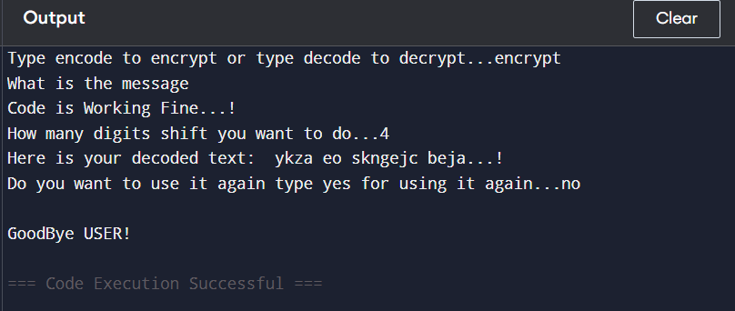

# Caesar Cipher in Python

## Project Description
This project is a beginner-friendly implementation of the **Caesar Cipher** encryption and decryption algorithm using Python.

The Caesar Cipher is one of the oldest and simplest cryptographic techniques. It works by shifting each letter of a message by a fixed number of positions in the alphabet.

This program allows users to:
- Encrypt a message (encode)
- Decrypt a message (decode)
- Choose their own shift value
- Preserve spaces, numbers, and symbols

The project demonstrates core programming fundamentals such as:
- Functions  
- Loops  
- Lists  
- Conditional statements  
- Modular arithmetic  
- User input handling  

---

## How the Algorithm Works

Example with shift = 3:
  
Original: hello

Shift: 3

Encrypted: khoor

Explanation:
- h → k  
- e → h  
- l → o  
- l → o  
- o → r  

Each character moves **3 positions forward** in the alphabet.

For decryption, the shift moves **backward**.

---

## Program Workflow

1. User chooses:
   - encode (for encryption)
   - decode (for decryption)

2. User enters the message.

3. User enters the shift value.

4. Program:
   - loops through each character
   - shifts alphabet characters
   - keeps symbols unchanged

5. Program prints the result.

6. User can run the program again.

---

## Key Concepts Used

This project demonstrates several core programming concepts in Python through the implementation of the Caesar Cipher encryption and decryption algorithm.

**1. Lists**  
The program stores all alphabet characters inside a list. Lists allow easy indexing, which helps in finding the position of each letter and shifting it according to the user-defined shift value.

**2. Functions (Modular Programming)**  
The program is divided into multiple functions to improve readability and structure:
- `caesar()` controls the overall program flow.
- `encrypt()` performs the encryption logic.
- `decrypt()` performs the decryption logic.  
Using functions makes the program more organized and reusable.

**3. Loops**  
A `for` loop is used to iterate through each character of the message. This allows the program to apply the shifting logic individually to every character.

**4. Conditional Statements**  
Conditional statements (`if-else`) are used to:
- Check whether a character exists in the alphabet list.
- Keep spaces, numbers, and special characters unchanged.
- Decide whether to run encryption or decryption based on user input.

**5. User Input Handling**  
The program uses the `input()` function to take:
- Operation type (encode or decode)
- Message text
- Shift value  
The `.lower()` function is used to standardize text input for easier processing.

**6. Modular Arithmetic**  
Modular arithmetic is used to handle cases where shifting goes beyond the range of the alphabet.  
The modulo operator (`%`) ensures that the index wraps around from `z` back to `a`, preventing index out-of-range errors.

**7. String Manipulation**  
Strings are constructed step-by-step by adding characters during encryption and decryption. This demonstrates how new strings can be built dynamically inside loops.

**8. Basic Cryptography Concept**  
The project introduces the fundamental idea of substitution ciphers, where each letter in the original message is replaced by another letter based on a fixed shift pattern.

---
## Sample Run
Type encode to encrypt or type decode to decrypt...encode

What is the message

hello world

How many digits shift you want to do...3

Here is your encoded text: khoor zruog

---
## Project Preview

Below is a sample run of the Caesar Cipher program:

This screenshot shows the encryption and decryption process using user input.

---
## Conclusion

This project is part of my learning journey in Python programming and problem solving. Through this implementation of the Caesar Cipher, I practiced modular programming, logical thinking, and user input handling. I plan to build more projects to improve my development skills and gain deeper knowledge in computer science and software development.

---
## Author

**Prem Kumar**  
B.Tech Computer Science Engineering Student  
Passionate about Programming, Ai/ML, Development and Problem Solving.

---

⭐ If you like this project, consider giving it a star!

