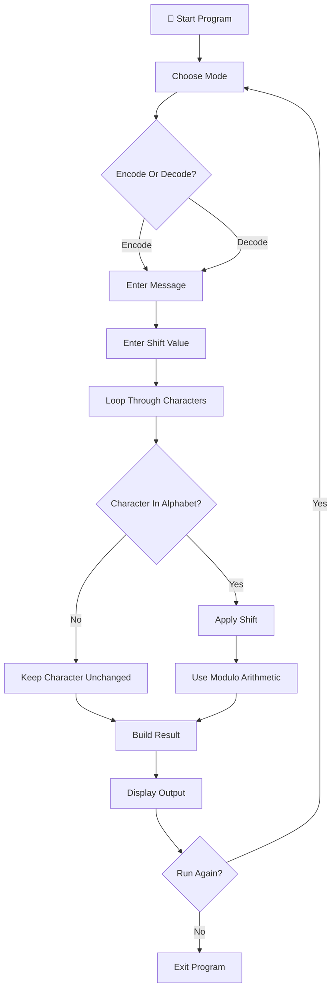
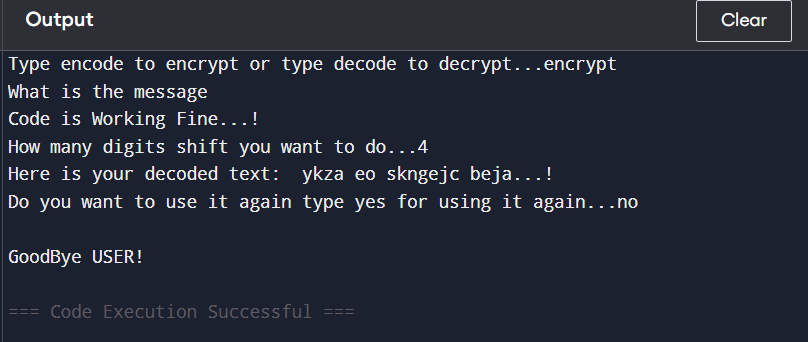

# 🔐 Caesar Cipher (Python)


A beginner-friendly implementation of the **Caesar Cipher encryption and decryption algorithm** built using Python.

The Caesar Cipher is one of the oldest and simplest cryptographic techniques. It works by shifting each letter of a message by a fixed number of positions in the alphabet.

This project demonstrates **encryption, decryption, modular arithmetic, user input handling, functions, loops, and string manipulation** through an interactive command-line application.

---

# 📌 Table of Contents

* 🚀 Features
* 🔐 What is Caesar Cipher?
* 🧠 Algorithm Workflow
* 🔄 Encryption Example
* 🛠️ Tech Stack
* ▶️ How to Run
* 📸 Sample Run
* 🖼️ Project Preview
* 🎯 Learning Outcomes
* 🔮 Future Improvements
* 🤝 Contributing
* 📜 License
* 👨‍💻 Author
* ⭐ Support

---

# 🚀 Features

| Feature                | Description                                   |
| ---------------------- | --------------------------------------------- |
| 🔒 Encryption          | Convert plain text into encoded text          |
| 🔓 Decryption          | Decode encrypted messages                     |
| 🔢 Custom Shift Value  | User chooses shift amount                     |
| 🌍 Symbol Preservation | Spaces, numbers, and symbols remain unchanged |
| 🔄 Unlimited Usage     | Program can be used repeatedly                |
| ⚡ Instant Results      | Real-time encryption and decryption           |
| ⌨️ Interactive CLI     | Easy-to-use terminal interface                |

---

# 🔐 What is Caesar Cipher?

The Caesar Cipher is a substitution cipher where each letter in the message is replaced by another letter a fixed number of positions away in the alphabet.

### Example

Original Message:

```text
hello
```

Shift Value:

```text
3
```

Encrypted Message:

```text
khoor
```

### Character Transformation

| Original | Shift | Result |
| -------- | ----- | ------ |
| h        | +3    | k      |
| e        | +3    | h      |
| l        | +3    | o      |
| l        | +3    | o      |
| o        | +3    | r      |

---

# 🧠 Algorithm Workflow


```mermaid
flowchart TD

    A[🔐 Start Program] --> B[Choose Mode]

    B --> C{Encode Or Decode?}

    C -->|Encode| D[Enter Message]
    C -->|Decode| D

    D --> E[Enter Shift Value]

    E --> F[Loop Through Characters]

    F --> G{Character In Alphabet?}

    G -->|No| H[Keep Character Unchanged]

    G -->|Yes| I[Apply Shift]

    I --> J[Use Modulo Arithmetic]

    H --> K[Build Result]

    J --> K

    K --> L[Display Output]

    L --> M{Run Again?}

    M -->|Yes| B

    M -->|No| N[Exit Program]
```

---

# 🔄 Encryption & Decryption Logic

### Encryption Formula

```text
New Position = (Current Position + Shift) % 26
```

### Decryption Formula

```text
New Position = (Current Position - Shift) % 26
```

### Why Modulo (%)?

Modulo arithmetic ensures that the alphabet wraps around correctly.

Example:

```text
z + 3
```

becomes:

```text
c
```

instead of causing an index error.

---

# 🛠️ Tech Stack

<table>
<thead>
<tr>
<th>⚙️ Technology</th>
<th>💡 Purpose</th>
</tr>
</thead>

<tbody>

<tr>
<td><strong>🐍 Python 3</strong></td>
<td>Main programming language</td>
</tr>

<tr>
<td><strong>📋 Lists</strong></td>
<td>Store alphabet characters</td>
</tr>

<tr>
<td><strong>🧩 Functions</strong></td>
<td>Organize encryption and decryption logic</td>
</tr>

<tr>
<td><strong>🔀 Conditional Logic</strong></td>
<td>Handle character processing</td>
</tr>

<tr>
<td><strong>🔁 Loops</strong></td>
<td>Process each character in the message</td>
</tr>

<tr>
<td><strong>⌨️ User Input</strong></td>
<td>Collect messages and shift values</td>
</tr>

<tr>
<td><strong>🧮 Modular Arithmetic</strong></td>
<td>Wrap letters around the alphabet</td>
</tr>

</tbody>
</table>

---

# ▶️ How to Run

<table>
<thead>
<tr>
<th>🚀 Step</th>
<th>💻 Command</th>
<th>📌 Description</th>
</tr>
</thead>

<tbody>

<tr>
<td><strong>1️⃣ Clone Repository</strong></td>
<td><code>git clone https://github.com/your-username/caesar-cipher.git</code></td>
<td>Download project files</td>
</tr>

<tr>
<td><strong>2️⃣ Navigate To Folder</strong></td>
<td><code>cd caesar-cipher</code></td>
<td>Open project directory</td>
</tr>

<tr>
<td><strong>3️⃣ Run Program</strong></td>
<td><code>caesar cipher.py</code></td>
<td>Launch the application</td>
</tr>

</tbody>
</table>

---

# 📸 Sample Run

```text
Type encode to encrypt or type decode to decrypt...encode

What is the message

hello world

How many digits shift you want to do...3

Here is your encoded text: khoor zruog
```

---

# 🖼️ Project Preview

Below is a sample run of the Caesar Cipher application.



This preview demonstrates both encryption and decryption functionality using user-provided input.

---

# 🎯 Learning Outcomes

<table>
<thead>
<tr>
<th>📚 Concept</th>
<th>💡 What I Learned</th>
</tr>
</thead>

<tbody>

<tr>
<td><strong>📋 Lists</strong></td>
<td>Managing and indexing collections of data</td>
</tr>

<tr>
<td><strong>🧩 Functions</strong></td>
<td>Writing reusable and modular code</td>
</tr>

<tr>
<td><strong>🔁 Loops</strong></td>
<td>Iterating through message characters</td>
</tr>

<tr>
<td><strong>🔀 Conditional Logic</strong></td>
<td>Handling letters and symbols differently</td>
</tr>

<tr>
<td><strong>🧮 Modular Arithmetic</strong></td>
<td>Wrapping alphabet positions efficiently</td>
</tr>

<tr>
<td><strong>⌨️ User Input</strong></td>
<td>Building interactive command-line programs</td>
</tr>

<tr>
<td><strong>🔐 Cryptography Basics</strong></td>
<td>Understanding substitution ciphers and encryption concepts</td>
</tr>

</tbody>
</table>

💡 *This project strengthened my understanding of Python fundamentals, problem solving, and introductory cryptography concepts.*

---

# 🔮 Future Improvements

* 🔑 Multiple cipher algorithms
* 🖥️ Graphical User Interface (GUI)
* 📂 File encryption support
* 🌐 Web-based version
* 🔒 Stronger encryption techniques
* 📈 Encryption statistics dashboard

---

# 🤝 Contributing

Contributions are always welcome!

Whether you're a beginner learning Python or someone interested in cryptography, feel free to contribute.

### Steps To Contribute

* Fork this repository
* Create a new branch
* Make your changes
* Commit your work
* Submit a Pull Request

Let's build and learn together 🚀

---

# 📜 License

<div align="center">

### 🛡️ MIT License

This project is licensed under the MIT License.

</div>

---

### 🔓 What This Means

* ✅ Use the project freely
* ✅ Modify the source code
* ✅ Share your own versions
* ✅ Use commercially

Just provide proper attribution.

---

# 👨‍💻 Author

<div align="center">

## Prem Kumar

🎓 B.Tech Computer Science Engineering Student

💡 Passionate about Programming, AI/ML, Development, Cryptography, and Problem Solving.

</div>

---

### 🌟 About Me

* 🎓 Computer Science Student
* 🐍 Learning Python and Software Development
* 🔐 Interested in Cybersecurity and Cryptography
* 🚀 Building projects consistently to improve skills

> *"Keep building. Keep learning. Keep going beyond."*

---

# ⭐ Support

<div align="center">

### 💙 Show Your Support

If you found this project useful or interesting, consider supporting it.

</div>

---

### 🚀 Ways To Support

* ⭐ Star this repository
* 🍴 Fork the project
* 🛠️ Contribute improvements
* 📢 Share it with other learners

---

✨ Every star motivates me to keep building, learning, and sharing more projects with the community.
